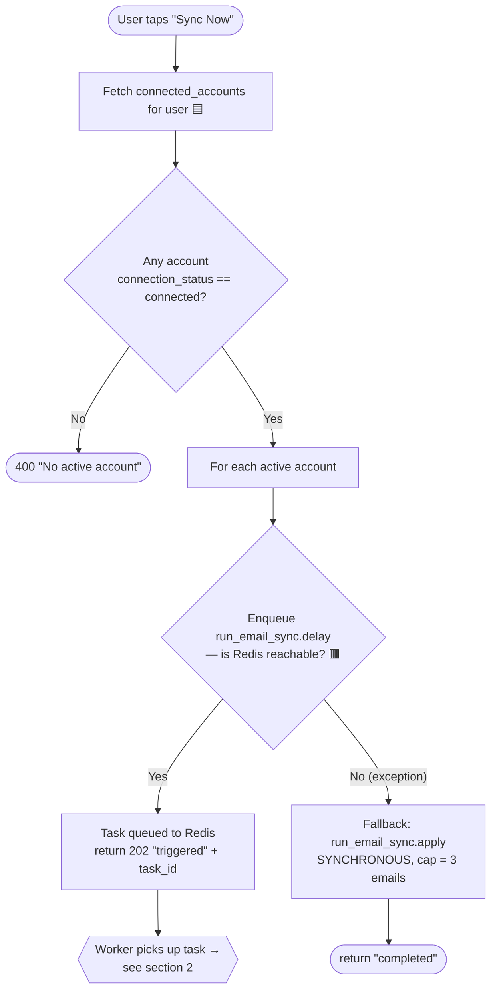
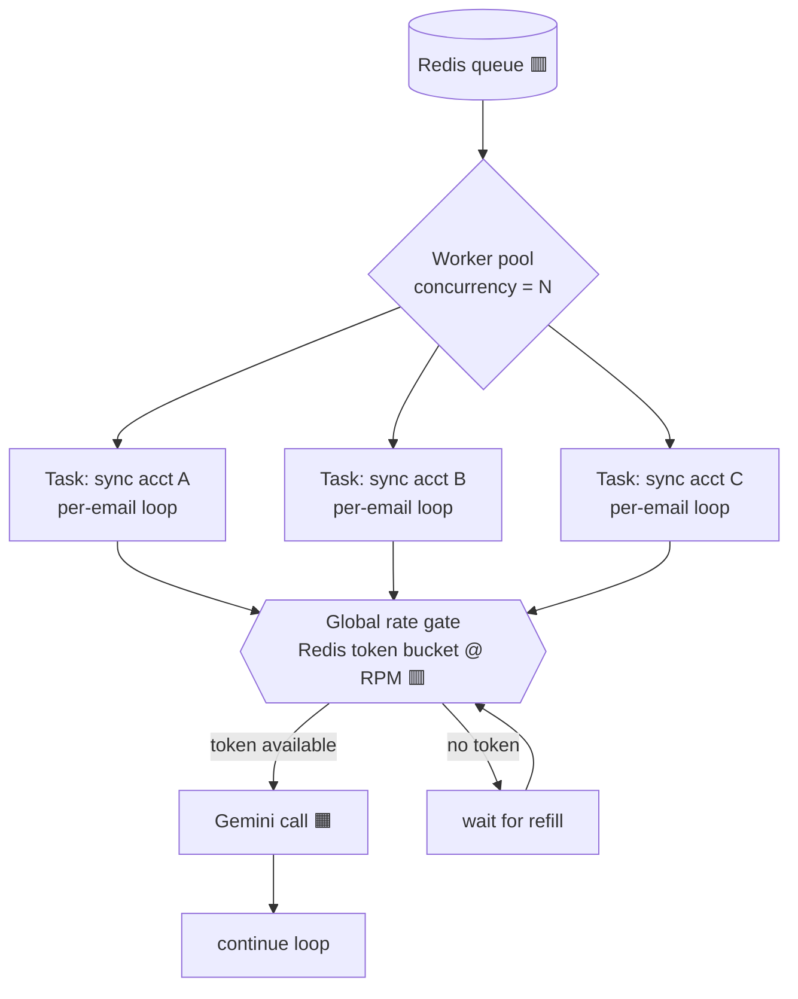

# Email sync — full data flow & decision points

Where decisions are made (◇), where data is processed (▭), and which external service
each step talks to. Source: [sync.py](../backend/app/api/v1/endpoints/sync.py),
[sync_task.py](../backend/app/tasks/sync_task.py), [event_merge.py](../backend/app/services/event_merge.py).

## Legend
- **◇ Decision** — a branch in the code.
- **▭ Process** — work / a write.
- **Calls:** 🟦 Supabase (Postgres) · 🟪 Qdrant (vectors) · 🟧 Gemini (AI) · 🟫 IMAP · 🟥 Redis.

## 1. Trigger phase (web request — `POST /api/v1/sync/trigger`)

**Key decision:** Redis up → async (worker, up to 10). Redis down → synchronous fallback in
the web request, capped at 3 (so the HTTP call doesn't hang on the throttle).

## 2. Worker setup (`run_email_sync(user_id, account_id, max_emails=10)`)

```mermaid
flowchart TD
    S([Worker receives task 🟥]) --> A[Load account by id+user 🟦]
    A --> B{Account found?}
    B -- No --> B1([return failed])
    B --> C{Has imap_username<br/>+ encrypted_token?}
    C -- No --> C1([return failed])
    C -- Yes --> D[Decrypt token]
    D --> E{last_synced_at set?}
    E -- Yes --> F[criteria = date_gte&#40;last_synced date&#41;<br/>INCREMENTAL]
    E -- No --> G[criteria = ALL]
    F --> H[IMAP login + fetch newest-first,<br/>cap max_emails 🟫]
    G --> H
    H --> I[Load seen_message_ids =<br/>existing message_ids for user 🟦]
    I --> J{{Per-email loop →<br/>see section 3}}
```

**Key decision:** `last_synced_at` set → only fetch mail **since that date** (why a re-sync
often pulls just a few). Otherwise fetch everything up to the cap.

## 3. Per-email loop — the heart of it

```mermaid
flowchart TD
    L([Next email]) --> M[message_id = get_message_id&#40;msg&#41;]
    M --> N{message_id in<br/>seen_message_ids?}
    N -- Yes --> N1[skipped++ → continue ⏭️<br/>no Gemini call] --> L
    N -- No --> O[add to seen]
    O --> P[Extract event intel 🟧<br/>~3.5s ·  is_update / update_type / deadline]
    P --> Q{is_update AND<br/>update_type == deadline_extension<br/>AND deadline present?}
    Q -- No --> U[matched_event = None]
    Q -- Yes --> R[find_matching_event:<br/>embed 🟧 → Qdrant search 🟪 →<br/>active events 🟦 → confirm yes/no 🟧]
    R --> S{Matched event found<br/>AND new deadline strictly later?<br/>&#40;forward-only&#41;}
    S -- Yes --> T[apply_extension:<br/>move original deadline +<br/>append deadline_history 🟦]
    S -- No --> U
    T --> V
    U --> V[Build event_data<br/>deadline = None if matched else extracted]
    V --> W[INSERT event 🟦]
    W --> X{Insert result?}
    X -- empty --> X1[log error → continue] --> Z
    X -- unique-violation 23505 --> X2[skipped++ → continue ⏭️] --> Z
    X -- ok --> Y[chunk body → embed batch 🟧 →<br/>upsert vectors 🟪 · processed++]
    Y --> Z{More emails<br/>AND not last?}
    Z -- Yes --> TH[sleep 13s ⏳ THROTTLE<br/>73% of total time] --> L
    Z -- No --> EXIT([Update last_synced_at = now 🟦<br/>return processed / skipped])
```

### The four decisions that matter
| ◇ Decision | Branch taken | Effect |
|---|---|---|
| `message_id` already seen? | **Yes → skip** (no Gemini) | dedup — idempotent re-syncs |
| Is this a deadline-extension update? | **Yes → try merge** | routes to matching instead of a plain insert |
| Matched event + deadline later? | **Yes → apply_extension** | mutates the *original* event (forward-only) |
| Insert hit unique constraint? | **Yes → skip** | hard dedup guard at the DB |

## 4. Where data lands

| Data | Store | When |
|---|---|---|
| Event row (display_name, deadline, summary, message_id, …) | 🟦 Supabase `events` | every processed email |
| Deadline change log | 🟦 Supabase `events.deadline_history` | only on an applied extension |
| Body chunks + 768-dim vectors | 🟪 Qdrant `krnl_email_chunks` | every processed email |
| Last sync timestamp | 🟦 Supabase `connected_accounts.last_synced_at` | end of run |
| Task state / result | 🟥 Redis | async path |

## 5. Cost per decision path (warm)

- **Skipped (dup):** ~0ms of AI — just a set lookup. Cheap.
- **Plain new event:** extract 3.5s 🟧 + embed 0.6s 🟧 + writes ~0.6s + **13s sleep** ≈ 18s.
- **Deadline-extension new email:** above **+** embed + Qdrant search + 1 confirm call 🟧
  (~+1–4s) when the update branch fires.

See [sync-performance.md](sync-performance.md) for the bottleneck breakdown.

## 6. What changes if you raise `worker_concurrency`

**The trap:** `sleep(13)` is a *per-worker* throttle. With `concurrency=1` it serializes all
Gemini calls globally only because one task runs at a time. Set `concurrency = N` and you get
**N copies of the per-email loop in parallel**, each pacing itself → **N× the Gemini request
rate** → 429s. The sleep does NOT coordinate across workers.

**Required change before N > 1:** move the throttle from the per-task `time.sleep` to the
**global rate gate** above (a Redis token bucket sized to your Gemini RPM). Then concurrency
controls how many emails are *in flight*; the gate caps the actual call rate no matter how
many workers exist.

### How much to set
Bounded by the lower of two ceilings:

| Ceiling | Rule of thumb |
|---|---|
| **Gemini RPM** | 2 calls/email. On the **free tier → 1** (RPM is the ceiling; more workers just 429). |
| **Host RAM** | Each prefork child ≈ 150–300 MB. 512 MB–1 GB host → **1–2** workers. |

- **Free tier:** `concurrency = 1` (current). Don't raise it.
- **Paid tier:** `concurrency = 2–4`, *after* the global gate is in place and if RAM allows.
- **Beyond that:** scale horizontally — add worker *nodes*, all sharing the same gate.
